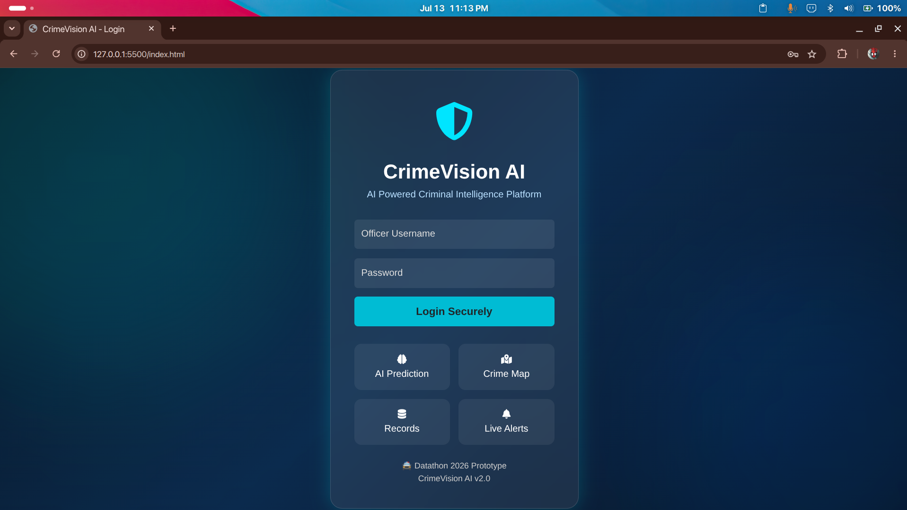
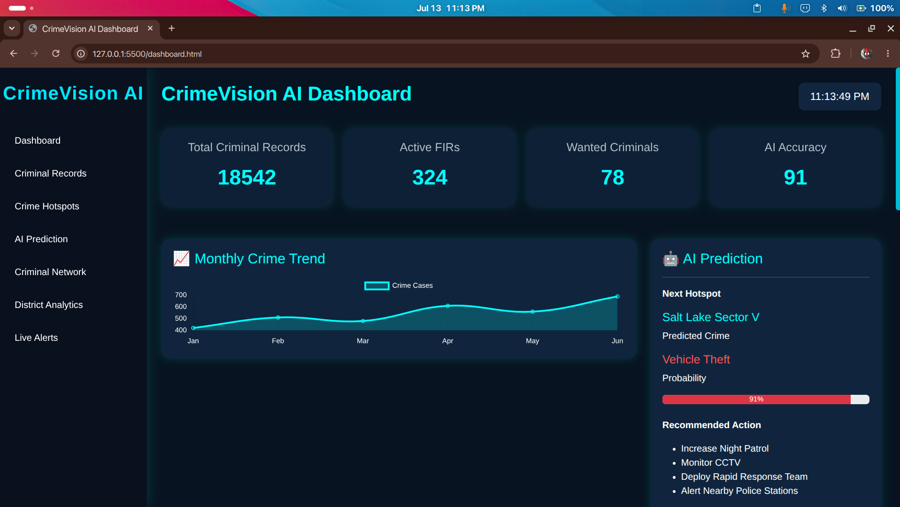
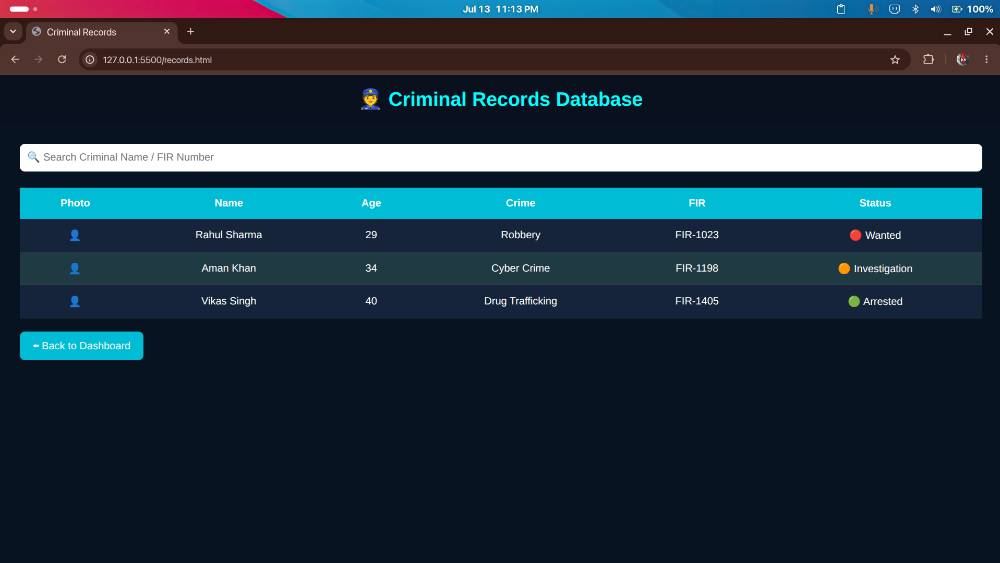
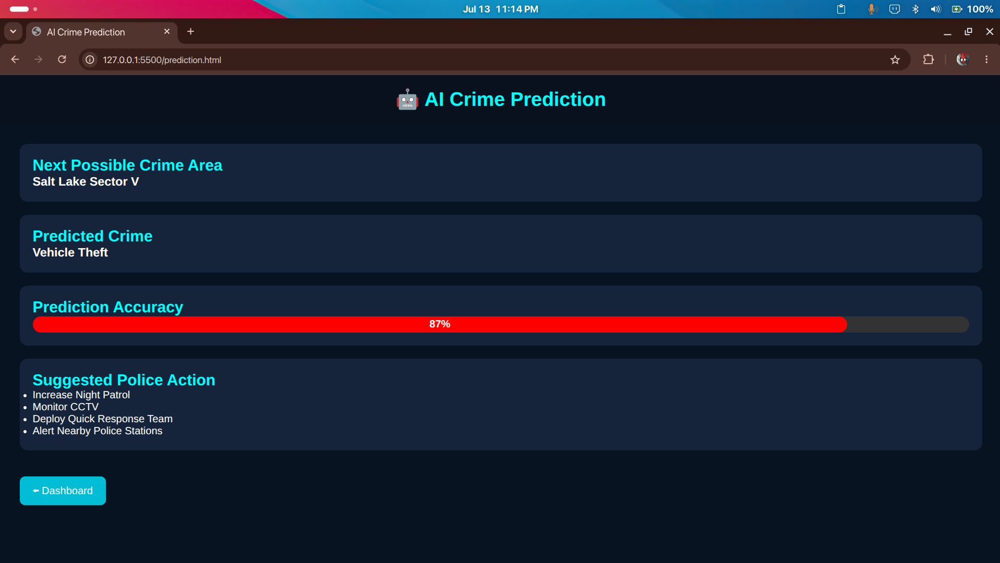

# 🚔 CrimeVision AI

> **AI-Powered Criminal Intelligence & Crime Analytics Platform**

CrimeVision AI is a modern web-based crime intelligence dashboard designed to assist law enforcement agencies with crime monitoring, criminal record management, hotspot visualization, district-wise analytics, and AI-assisted crime prediction.

Built as a prototype for **Datathon 2026**, the platform demonstrates how data visualization, AI insights, and interactive dashboards can help improve public safety and decision making.

---

## 📸 Screenshots

> Add screenshots here after uploading them to GitHub.

| Login | Dashboard |
|-------|-----------|
|  |  |

| Records | Prediction |
|----------|------------|
|  |  |

---

# ✨ Features

## 🔐 Secure Login

- Officer authentication
- Protected dashboard access
- Username/password validation

---

## 📊 Dashboard

- Total Criminal Records
- Active FIR Counter
- Wanted Criminals
- AI Prediction Accuracy
- Live Digital Clock
- Monthly Crime Trends
- Crime Category Distribution

---

## 👮 Criminal Records

- Search criminal records
- FIR information
- Status tracking
- Criminal database

---

## 📍 Crime Hotspot Analysis

- Interactive hotspot visualization
- High-risk zones
- Medium-risk zones
- Safe zones

---

## 🤖 AI Crime Prediction

Predicts

- Future hotspot
- Possible crime category
- Prediction confidence
- Recommended police actions

---

## 🕸 Criminal Network Analysis

Visualizes

- Criminal relationships
- Gang associations
- Risk levels

---

## 🏙 District Analytics

Provides

- Crime count
- Solved cases
- District-wise comparison
- Crime trends

---

## 🚨 Smart Alerts

Displays

- High priority alerts
- Medium priority alerts
- Safe zone notifications

---

# 🛠 Tech Stack

### Frontend

- HTML5
- CSS3
- JavaScript (ES6)

### Libraries

- Bootstrap 5
- Chart.js
- Font Awesome
- Leaflet.js
- OpenStreetMap

---

# 📁 Project Structure

```
CrimeVision/
├── ai.png
├── alert.html
├── dashboard.html
├── dashboard.png
├── district.html
├── hotspot.html
├── index.html
├── login.png
├── network.html
├── prediction.html
├── README.md
├── records.html
├── records.png
├── script.js
├── style.css
└── screenshots/
    ├── ai.png
    ├── dashboard.png
    ├── login.png
    └── records.png
```

---

# 🚀 Getting Started

## Clone Repository

```bash
git clone https://github.com/srivastavaanchal82-cyber/CrimeVision.git
```

Move into project

```bash
cd CrimeVision
```

Open

```text
index.html
```

or use

VS Code → Live Server

---

# 🔑 Demo Credentials

```
Username : sarvision

Password : aanchal@123
```

---

# 📊 Current Modules

| Module | Status |
|---------|--------|
| Login | ✅ |
| Dashboard | ✅ |
| Criminal Records | ✅ |
| AI Prediction | ✅ |
| District Analytics | ✅ |
| Smart Alerts | ✅ |
| Crime Hotspots | ✅ |
| Criminal Network | ✅ |

---

# 📈 Future Enhancements

- Database Integration
- Firebase Authentication
- Machine Learning Model
- Real-time Crime Prediction
- CCTV Integration
- Face Recognition
- Voice Assistant
- Live Police Tracking
- Crime Heatmaps
- REST API
- Role-based Access
- Dark/Light Theme
- Export Reports
- Mobile Responsive Dashboard

---

# 🎯 Use Cases

- Police Departments
- Smart Cities
- Government Agencies
- Crime Analytics
- Law Enforcement
- Public Safety
- Research & Education

---

# 📌 Highlights

- Modern Cyber UI
- Responsive Design
- Interactive Dashboard
- Crime Visualization
- AI-Based Insights
- Search Functionality
- Animated Statistics
- Interactive Charts
- Smart Alerts
- Clean Architecture

---

# 📷 Built With

- Bootstrap
- Chart.js
- Leaflet Maps
- OpenStreetMap
- Font Awesome
- HTML
- CSS
- JavaScript

---

# 👥 Contributors

### Project Team

- **Aanchal Srivastav**
- **Parth Singh**
- **Samiya Ali**
- **Adrija Mondal**

---

# 🤝 Contributing

Contributions are welcome.

1. Fork the repository
2. Create a feature branch

```bash
git checkout -b feature-name
```

3. Commit changes

```bash
git commit -m "Added new feature"
```

4. Push

```bash
git push origin feature-name
```

5. Open a Pull Request

---

# 📄 License

This project is developed for educational and demonstration purposes.

---

# ⭐ Support

If you found this project useful,

⭐ Star the repository

🍴 Fork it

🐞 Report issues

💡 Suggest improvements

---

## 🚔 CrimeVision AI

**"Empowering Smarter Policing Through Artificial Intelligence and Data Analytics."**